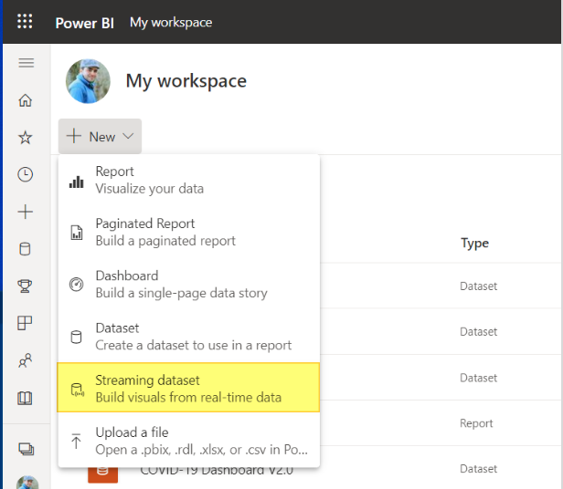
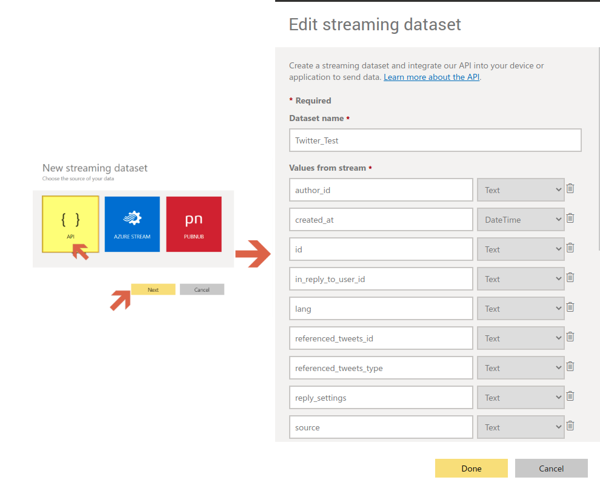
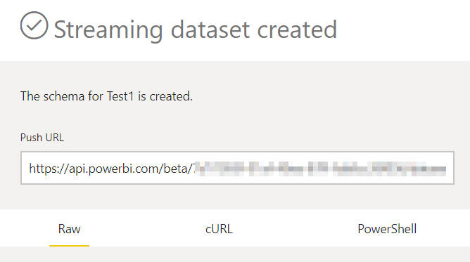

# Twitter to PowerBI Stream

[](https://github.com/RichardLitt/standard-readme)


## Table of Contents

- [Background](#background)
- [Preparation](#Preparation)
- [Usage](#usage)
- [Resources](#Resources)
- [License](#license)

## Background
This script is made to collect Tweets/Tweeter Activity from Twitter and stream into PowerBI Streaming Dataset. To get started you will need the following:
### 1. Twitter Developer Account:
 Check out Twitter [Official Docs](https://developer.twitter.com/en/docs/developer-portal/overview) to make your own. Once created you will need a valid bearer token.
### 2. PowerBI Premium Account:
Or any other account where your can create streaming dataset with API Endpoint. For more details on creating Streaming Dataset refer to my [blogpost](https://ozeidi.wordpress.com/2021/11/14/powerbi-for-realtime-data/).

## Preparation
### 1. Create the Streaming Dataset:
This will basically act as an endpoint and placeholder to hold your streaming data.

- Go to Personal Worksapce in [PowerBi Servise](https://app.powerbi.com/).
- Click “New” and select “Streaming dataset”.

- Select “API” and click next. 

- Add the dataset variables as per the sanpshot above. Use the below JSON for the exact naming. These variables are the ones that will be collected by the python script from twitter and streamed to PBI. 
```diff
- Imporatnt Note: Names Must match the below! Otherwise the script wont work.
```
```sh
[
{
"author_id" :"AAAAA555555",
"created_at" :"2022-01-04T08:13:34.955Z",
"id" :"AAAAA555555",
"in_reply_to_user_id" :"AAAAA555555",
"lang" :"AAAAA555555",
"referenced_tweets_id" :"AAAAA555555",
"referenced_tweets_type" :"AAAAA555555",
"reply_settings" :"AAAAA555555",
"source" :"AAAAA555555",
"text" :"AAAAA555555",
"user_id" :"AAAAA555555",
"user_name" :"AAAAA555555",
"user_username" :"AAAAA555555"
}
]
```
- Click done and copy the API PUSH URL. Treat this URL very cautiously, because anyone who have it can push datapoints to your dataset.


- for security and to avoid having the url in plain script, I save the URL into Environment Variable. Later on, the python script will read the Push URL from this environment variable.
```sh
export PBI_URL=https://api.powerbi.com/beta/XXXXXXXXXXXXXXX
```

### 1. Get Twitter Bearer Token
- From your twitter [Developer Portal](https://developer.twitter.com/en/portal/dashboard) generate Bearer Token to authenticate the connection from the script. The Bearer Toekn is equivalent to your twitter credentials and should be treated confidentialy.

- Save your Twitter Bearer Token into Environment Variable.
```sh
export BEARER_TOKEN=XXXXXXXXXXXXXXX
```

## Installation

1. Clone this repo to your machine.

```sh
$ git clone https://github.com/Ozeidi/TWITTER_POC.git
```


## Usage
1. Clone this repo to your machine.

```sh
git clone https://github.com/Ozeidi/TWITTER_POC.git
```

2. Set the rules to what Data you want to collect from twitter Stream in the: `config/rules.py`. By default, the script will collecting Data related to PDO, Major Telecom Companies and Banks in Oman. To change these rules refer to Twitter's Docs on [Filtered Stream Rules](https://developer.twitter.com/en/docs/twitter-api/tweets/filtered-stream/integrate/build-a-rule).


3. Run the Script and let the festival start!
```sh
python Twitter_Stream.py
```

##  Resources
- https://www.vicinitas.io/ :
    An excellent website that gives you thorough analysis of a twitter account, Hashtage and Followers.
## License

[MIT](LICENSE) © Omar Al Zeidi